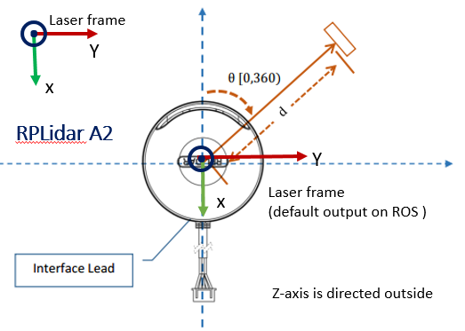

RPLIDAR ROS 2 Package
=====================================================================

ROS node and test application for RPLIDAR

Visit following Website for more details about RPLIDAR:

rplidar roswiki: http://wiki.ros.org/rplidar

rplidar HomePage:   http://www.slamtec.com/en/Lidar

rplidar SDK: https://github.com/Slamtec/rplidar_sdk

rplidar Tutorial:  https://github.com/robopeak/rplidar_ros/wiki

Getting Started
=====================================================================
1) Clone this project to your colcon workspace src folder.
2) Build the package: ```colcon build --symlink-install```

Running the Package
=====================================================================
There are two ways to run the RPLIDAR ROS 2 Package.

I. Run rplidar node and view in the rviz
------------------------------------------------------------
RPLIDAR A1/A2: ```ros2 launch rplidar_ros view_rplidar.launch.py```

RPLIDAR A3: ```ros2 launch rplidar_ros view_rplidar_a3.launch.py```

RPLIDAR S1: ```ros2 launch rplidar_ros view_rplidar_s1.launch.py```

II. Run rplidar node and view using test application
------------------------------------------------------------
RPLIDAR A1/A2: ```ros2 launch rplidar_ros rplidar.launch.py``` OR ```ros2 run rplidar_ros rplidar_composition```

RPLIDAR A3: ```ros2 launch rplidar_ros rplidar_a3.launch.py```

RPLIDAR S1: ```ros2 launch rplidar_ros rplidar_s1.launch.py```

Frame Orientation
=====================================================================

